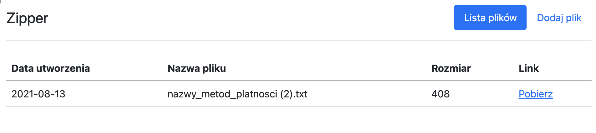

# Zipper

Zadanie rekrutacyjne na stanowisko Ruby on Rails Developer w Siepomaga.pl

Zipper to aplikacja, która pomaga w bezpiecznym przesyłaniu załączników w komunikacji mailowej. Użytkownik może w prosty sposób wrzucić jeden lub więcej plików, które zostaną skompresowane oraz zaszyfrowane przy użyciu losowego hasła. Dzięki temu użytkownik może przesłać link do załączników mailem, a hasło do odbiorcy inną metodą komunikacji (np. SMSem). 



### Wymagania techniczne

```
ruby 2.7.0
rails 6.1.4
bundler 2.1.4
```

### Uruchomienie aplikacji

```bash
bundle install
bundle exec rails db:migrate
bundle exec rails s
```

### Testy

```
bundle exec rspec
```

## Zadania główne

#### ZD-1

Po wrzuceniu pliku przez użytkownika, powinien on zostać skompresowany (zip) oraz zaszyfrowany losowym hasłem, które zostanie wyświetlone (tylko raz) użytkownikowi. Ze względów bezpieczeństwa hasło nie powinno być przechowywane w bazie danych.

#### ZD-2

Umożliwienie dodania więcej niż jednego pliku w formularzu, które zostaną skompresowane do jednego archiwum.

#### ZD-3

Użytkownikom zależy na prywatności, żeby nikt nie miał dostępu do ich plików. Dodaj możliwość rejestracji i logowania (jak najprościej, ale bezpiecznie, np. przy użyciu has_secure_password). Nie ma konieczności potwierdzania adresu email.

## Zadania dodatkowe

### Junior

#### ZD-4

Niektórzy użytkownicy dodali bardzo dużą ilość plików, przez co aplikacja zrobiła się wolna oraz nieczytelna. Dodaj paginację do tabeli z plikami (przy użyciu dowolnej biblioteki).

#### ZD-5

Przy większych plikach rozmar w bajtach jest ciężki do rozszyfrowania. Dopasuj wyświetlanie rozmaru wraz z jednostką do wielności pliku, np. (1.5Mb, 300Kb, 80B).

#### ZD-6

Użytkownicy zgłosili, że jak zapiszą formularz bez wybrania pliku, to aplikacja przestaje działać. Sprawdź, w czym jest problem i napraw go.

### Regular / Senior

#### ZD-7

Stwórz API JSONowe dla aplikacji, przy uzyciu biblioteki Grape API. Wymagane funkcjonalności:

* rejestracja
* logowanie
* upload plików
* lista plików

## Informacje dodatkowe

* wszystkie zmiany wrzuć do jednego PRa, a każde zadanie powinno być jednym commitem (z numerem zadania w nazwie)
* pamiętaj o testach i ich pokryciu :)
